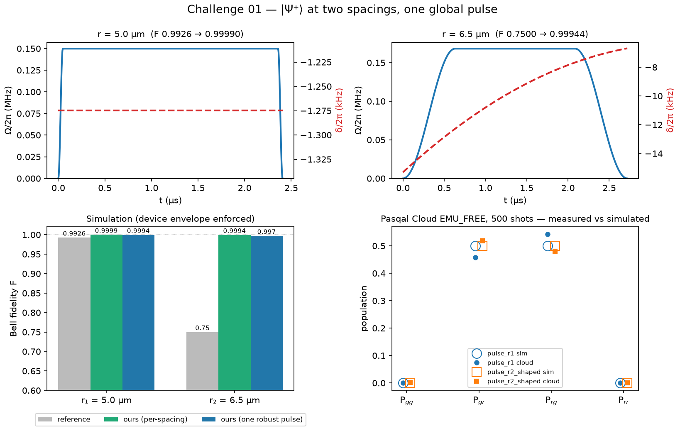
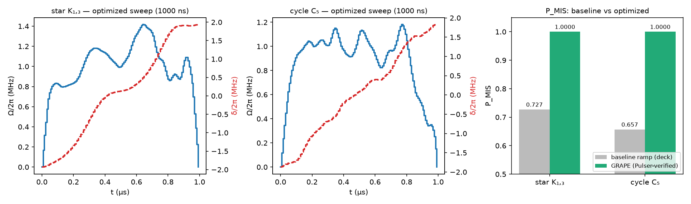

# A Real Quantum Hackathon — team solutions

**Harmoniqs × Pasqal × Microsoft · July 29 2026 · Microsoft Garage NYC**

One control problem, three stages: a register of neutral atoms under the
analog-mode Rydberg Hamiltonian, driven by a single global pulse
(Ω(t), δ(t)) plus the atom positions. We iterate in exact simulation and
validate on Pasqal Cloud — including one run on the real quantum computer.

**→ Judges / presenters: start at [SUBMISSION.md](SUBMISSION.md) — the
criteria-to-evidence score sheet, resource ledger, and slide outline.**

## Challenge index

| | Status | Baseline → Ours | Evidence |
|---|---|---|---|
| **[Challenge 01](#challenge-01--entangle-two-atoms)** — entangle 2 atoms at two spacings | ✅ complete **+ real QPU** | F: 0.9926/0.7500 → **1.000000/1.000000** | [REPORT](ch01/REPORT.md) · [docs/ch01/](docs/ch01/) |
| **[Challenge 02](#challenge-02--encode-a-graph-solve-it)** — encode a graph, measure its MIS | ✅ complete, cloud-validated | P_MIS: 0.727/0.657 → **0.999998/0.999999** | [REPORT](ch02/REPORT.md) · [docs/ch02/](docs/ch02/) |
| Challenge 03 — beat published results at 10–80+ atoms | not attempted | — | — |

*Every number in this repo is produced by a committed scorer, traceable to
its source, and cross-validated in Pulser (the judge's simulator). Method
discipline: [docs/ch01/08-prompts.md](docs/ch01/08-prompts.md).*

---

## Challenge 01 — entangle two atoms

**Task:** prepare the Bell state |Ψ⁺⟩ = (|gr⟩+|rg⟩)/√2 with one global
pulse, at spacings 5.0 µm *and* 6.5 µm, beating the reference pulse at both.

**Key insight:** the baseline fails at 6.5 µm because blockade quality
V/Ω = 1.8 lets 22% of the population leak into the forbidden |rr⟩. V is
geometry, but Ω is ours — restore V/Ω ≥ 9, then push to the quantum speed
limit with optimal control.

| Pulse generation | r₁ = 5.0 µm | r₂ = 6.5 µm | T |
|---|---|---|---|
| Reference (baseline) | 0.992564 | 0.750003 | 352 ns |
| v1 analytic (4 parameters, interpretable) | 0.999895 | 0.999435 | ~2.4 µs |
| v1r one spacing-robust waveform | 0.999443 | 0.997008 | 2.4 µs |
| v2 time-optimal (near QSL = 177 ns) | 0.999999 | 0.999998 | 224/420 ns |
| **v3 hardware-true smooth** | **1.000000** | **1.000000** | 352/600 ns |

**Hardware:** 7 pulses × 500 shots on Pasqal Cloud emulator (all match
predictions) and one run on the **real FRESNEL_CAN1 QPU**: P_bell = 0.894
(447/500 shots entangled), inside the pre-registered error window.
Bonus science: the measured time–fidelity frontier, and a noise study
showing pulse *duration* is the dominant error coupling (it flips the
pulse ranking).

**Read:** [first-principles walkthrough](docs/ch01/00-overview.md) ·
[methods & provenance](docs/ch01/05-methods.md) ·
[time-optimal study](docs/ch01/06-time-optimal.md) ·
[hardware & QPU results](docs/ch01/07-hardware.md) ·
[formal report](ch01/REPORT.md)



---

## Challenge 02 — encode a graph, solve it

**Task:** place 4–5 atoms so blockade physics realizes a target graph
(star K₁,₃ / cycle C₅), then design one global sweep so a final photograph
returns a **maximum independent set** — the textbook NP-hard problem, run
as physics. Score: P_MIS, probability the measurement shows an optimal
solution.

**Key insight:** the baseline linear ramp is an adiabatic algorithm that
wastes its time budget cruising while losing probability at the minimum
spectral gap. We drop the adiabatic assumption entirely: full-space
adjoint GRAPE maximizes P_MIS directly (a *projector* objective — C₅ has
five equally-valid answers and gets a coherent superposition of all five,
each at exactly 0.200).

| Graph | Baseline (deck ramp, 4000 ns) | **Ours (GRAPE, 1000–2000 ns)** | Under noise |
|---|---|---|---|
| star K₁,₃ (α = 3) | 0.727135 | **0.999998** | 0.812 vs 0.380 |
| cycle C₅ (α = 2) | 0.657049 | **0.999999** | 0.926 vs 0.648 |

Also 4× *shorter* than the baseline — which is why the noise column is a
blowout, not a tie.

**Read:** [the challenge, in plain words](docs/ch02/01-challenge.md) ·
[methods & verification](docs/ch02/02-methods.md) ·
[formal report](ch02/REPORT.md)



---

## Repository layout

```
ch01/                 Challenge 01: scorer, pulses (.toml), optimizers,
                      cloud + QPU results, figures, REPORT.md
ch02/                 Challenge 02: P_MIS scorer, GRAPE optimizer,
                      sweeps (.npz), cloud results, figures, REPORT.md
docs/ch01/  00-08     first-principles primer → methods → time-optimal →
                      hardware/QPU → anti-hallucination prompt pack
docs/ch02/  01-02     challenge explainer → methods & verification
piccolo-solutions/    teammate's independent Julia/Piccolo track
                      (cross-validates our frontiers)
skills/               the Amicode skill packaging the ch01 recipe
```

## Reproduce

```bash
python3 -m venv .venv
.venv/bin/pip install pulser pulser-simulation pasqal-cloud scipy
.venv/bin/python ch01/score.py      # ch01 baselines + selftest
.venv/bin/python ch02/score02.py    # ch02 baselines + selftest
.venv/bin/python ch01/fast_opt.py   # ch01 time-fidelity frontier (~5 s)
.venv/bin/python ch02/opt02.py      # ch02 GRAPE (~2 min)
# cloud (your own project id):
export PASQAL_PROJECT_ID=<uuid>
.venv/bin/python ch01/pasqal_login.py <email>   # interactive; token-only after
```

Toolchain: [Amicode](https://harmoniqs.co) ·
[Pulser](https://pulser.readthedocs.io) + QuTiP ·
[pasqal-cloud](https://docs.pasqal.com/cloud/).
