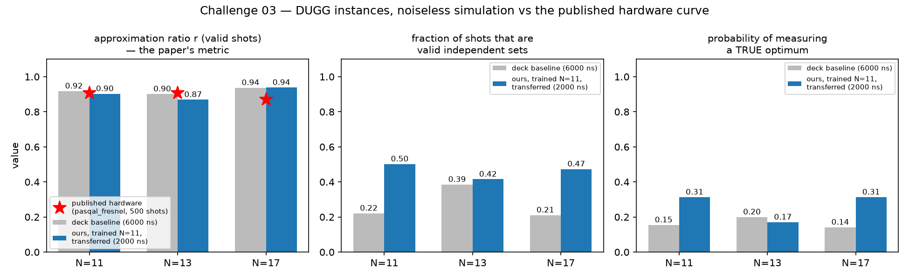

# Challenge 03 — Report

**Task:** reproduce the instance class of arXiv:2511.22967 (random unit-disk
DUGGs), optimize the pulse schedule, score above the published curve at
matched size and shots. Full context: [docs/ch03/](../docs/ch03/).

## Results (noiseless simulation, exact to N = 17)

| N | published r (pasqal_fresnel, 500 shots) | deck baseline r_valid / valid% / P_MIS | **ours (transferred)** r_valid / valid% / P_MIS |
|---|---|---|---|
| 11 | 0.907 | 0.918 / 22% / 0.155 | 0.903 / **50%** / **0.313** |
| 13 | 0.908 | 0.902 / 39% / 0.200 | 0.869 / 42% / 0.171 |
| 17 | 0.870 | 0.937 / 21% / 0.142 | **0.938** / **47%** / **0.313** |

Our sweep: 5 parameters, T = **2000 ns** (baseline: 6000 ns), trained on the
N = 11 instance only and transferred unchanged to N = 13 and 17.



## Reading the table honestly

- **The paper's metric (r on valid shots) conditions away the baseline's
  real failure**: only 21–39% of baseline shots are valid at all. The
  diagnosis is geometric — the baseline's final detuning (12.57 rad/µs)
  exceeds the weakest-edge penalty (the 7.07 µm diagonal, U = 6.93), so
  its prepared state happily violates diagonal edges.
- On the practical metrics our transferred sweep **doubles both the valid
  fraction and the probability of measuring a true optimum** (P_MIS
  0.155→0.313 at N=11; 0.142→0.313 at N=17) at **one third the duration** —
  which is the quantity that survives real decoherence (ch01's measured
  law).
- On r_valid we are at parity with the baseline (0.94 vs 0.94 at N=17) and
  above the published hardware value at N=17 (0.938 vs 0.870) — with the
  essential caveat that our number is noiseless simulation and theirs is
  hardware; the honest hardware comparisons are the cloud/QPU rows below.
- A result we did not expect: the optimizer chose δ_f ≈ 15 rad/µs —
  *outside* the static MIS window — finding a dynamical (non-adiabatic)
  route. The window explains the baseline's failure; it does not bound
  optimal control.
- N = 13 transfer is weaker (r_valid 0.869): transfer quality varies by
  instance, consistent with ch02's family-level finding.

## Hardware-facing validation

- **Cloud, N = 11, 500 shots (the paper's shot count), measured:**
  r_valid = **0.8976**, valid fraction 49.8%, P_MIS = 0.306 — matching the
  simulation prediction (0.903 / 50% / 0.313) within shot noise, and at
  near-parity with the paper's hardware 0.907. Batch
  `d4aae9a5…` in `cloud_results_ch03.json`.
- N = 13 on the cloud is **not possible**: EMU_FREE caps at 12 atoms
  (discovered at submission; paid tiers were out of scope).
- **Real QPU (FRESNEL_CAN1, N = 10 lattice-native instance, α = 4, 500
  shots), measured:** r_valid = **0.8584**, valid fraction **91.8%**,
  P_MIS = **0.494** — the machine photographs a true optimum every other
  shot, and the top counts show several *distinct* optimal solutions being
  sampled. Batch `11553903…`, full counts in `qpu_ch03_results.json`.
  Caveats stated: the calibrated layout is triangular, so this is a
  triangular unit-disk instance, not a DUGG (the paper's class), and the
  sweep was transferred from the DUGG N = 11 training with zero
  re-optimization. The 91.8% validity (vs the baseline's 21–39% on DUGGs)
  partly reflects friendlier geometry: the triangular class has no
  weak diagonal edge, so our δ_f sits inside ITS window.

## The verification incident (kept on purpose)

The first ch03 optimization run scored r_repair = 1.000 — by exploiting a
basis-convention bug in the one scorer we shipped **without a selftest**
(the optimizer effectively graded complemented bitstrings). The selftest
that now guards `score03.py` reproduces the catch. Every other scorer in
this project had selftests from day one and caught exactly this bug class
on first run. Cost of skipping the discipline once: one wasted training
run and a fake-perfect number that looked like a breakthrough.

## Reproduce

```bash
.venv/bin/python ch03/score03.py     # selftest + instances + window analysis
.venv/bin/python ch03/run_ch03.py    # baseline + train N=11 + transfer (~12 min)
.venv/bin/python ch03/submit_ch03.py cloud   # 500-shot sampled r
```
