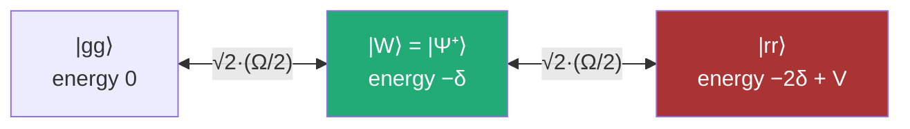
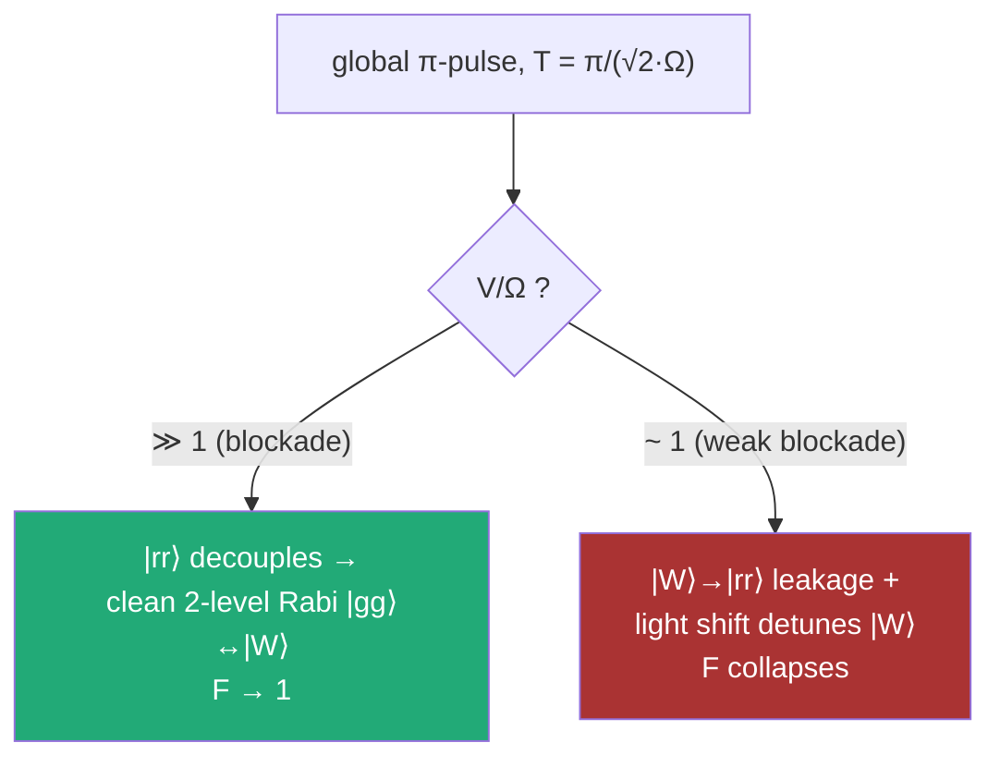

# The Physics — why the baseline fails, and why our fix is simple

## The symmetric ladder

With a **global** drive and a symmetric initial state |gg⟩, the two-atom
dynamics never leaves the symmetric subspace. Three states matter:

The target |Ψ⁺⟩ **is** the middle rung |W⟩. The enemy is the top rung |rr⟩,
detuned by the van-der-Waals shift **V = C₆/r⁶**.

## Two regimes, one number: V/Ω

| Spacing | V = C₆/r⁶ | V/Ω (reference, Ω = 2π·1 MHz) | F_ref | P_rr |
|---|---|---|---|---|
| r₁ = 5.0 µm | 55.4 rad/µs | 8.8 | 0.9926 | 0.006 |
| r₂ = 6.5 µm | 11.5 rad/µs | **1.83** | **0.7500** | **0.224** |

At r₂ the reference pulse dumps **22% of the population into |rr⟩**. That
single number is the entire baseline gap.

## The key insight: V is fixed, but V/Ω is a knob

You cannot move the atoms closer (the graph is given), but nothing forces
Ω = 2π×1 MHz. The device allows **T up to 6000 ns** — the baseline uses only
352 ns of it. Slowing down restores the blockade:

| Ω/2π (MHz) | V/Ω at r₂ | T = π/(√2Ω) | F (square pulse) |
|---|---|---|---|
| 1.00 | 1.8 | 352 ns | 0.750 |
| 0.30 | 6.1 | 1180 ns | 0.986 |
| 0.15 | 12.2 | 2356 ns | 0.996 |
| 0.10 | 18.3 | 3536 ns | 0.998 |

## Three refinements on top

1. **Smooth sin² ramps** (50–630 ns). Adiabatic with respect to the blockade
   gap; suppresses the spectral splatter of a square edge. Bonus: the
   device's finite modulation bandwidth passes a smooth pulse essentially
   unchanged — our modulated fidelities came out *higher* than unmodulated.

2. **Constant detuning offset.** |W⟩ is light-shifted by its dispersive
   coupling to |rr⟩ (scale Ω²/2V). A small δ < 0 recenters the collective
   resonance. Fitted: −0.008 rad/µs at r₁, −0.039 at r₂.

3. **Quadratic detuning ramp** (r₂ only). The light shift is time-dependent
   through the ramps — δ(t) = d₀ + d₁s + d₂(s²−⅓), s ∈ [−1,1], tracks it.
   Worth +0.0024: 0.99701 → **0.99944**.

## Results

| Pulse | r₁ = 5.0 µm | r₂ = 6.5 µm |
|---|---|---|
| Reference | 0.992564 | 0.750003 |
| Ours, per-spacing | **0.999895** | **0.999435** |
| Ours, one robust waveform | **0.999443** | **0.997008** |

The robust row is one *identical* waveform scoring at both spacings —
maximizing min(F(r₁), F(r₂)). See [04-product.md](04-product.md) for why
that row is the product.

## Traps we hit (so you don't)

- **Signed Ω**: optimizers drift into Ω < 0; Pulser amplitude is
  non-negative (a sign flip is a π phase jump). Constrain in the optimizer.
- **Off-grid durations**: everything must sit on the 4 ns clock — round
  *before* scoring so the reported number is the flown number.
- **Hardcoded constants**: C₆ from `device.interaction_coeff`, bounds from
  `channel.max_amp` / `max_abs_detuning`, at call time.
- **Basis ordering**: pulser's ground-rydberg basis is ('r','g') — for two
  atoms |rr⟩,|rg⟩,|gr⟩,|gg⟩ = indices 0,1,2,3. We verify with a selftest
  (idle pulse must stay in |gg⟩; deep-blockade π-pulse must hit |Ψ⁺⟩)
  rather than trusting documentation.
