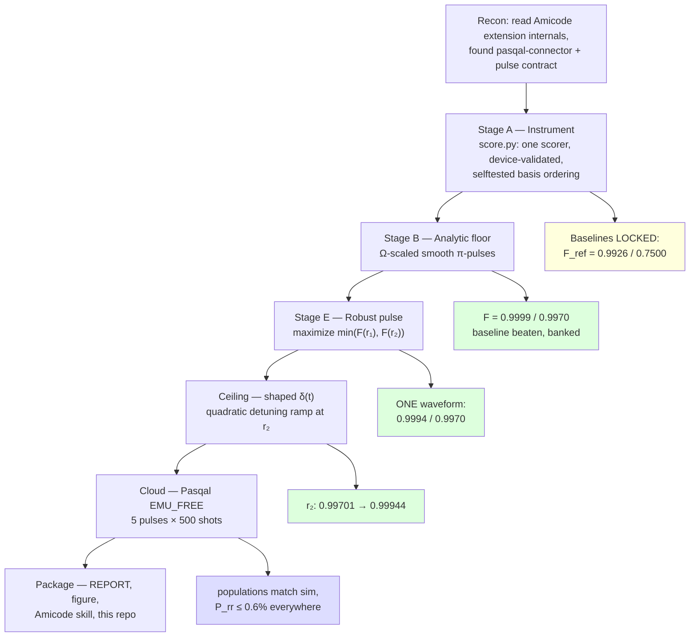

# The Process — what we did, in order, and why

Six hours of hacking, ~4 after setup. The strategy: **secure a floor before
chasing a ceiling**, and make every number come from one scorer.

## Decisions that mattered

**1. Baselines before optimization.** "We beat the reference" is
unfalsifiable until the reference is a number you computed yourself, in the
simulator you'll be judged by. First code written was `score.py`; first
numbers produced were 0.992564 and 0.750003.

**2. Analytic before numeric.** The physics said the whole r₂ gap is
blockade leakage, so a 4-parameter analytic family (Ω, δ, T, ramp) was
tested before any trajectory optimizer. It got to 0.997 in minutes —
a guaranteed submission that no optimizer crash could take away. The
bundled Piccolo template (out-of-envelope bounds, wrong C₆, hung solve)
validated this caution.

**3. Optimize against the flown waveform.** Pulses are quantized to 4 ns
knots *before* final scoring, and re-scored after zero-order hold — the
fidelity in the report is the fidelity of the artifact submitted, not of an
idealized continuous curve. Hardware modulation was checked too
(`with_modulation=True`); smooth pulses pass through unchanged.

**4. Token-only cloud auth.** No API keys exist for Pasqal Cloud (Auth0
username/password only). The human runs one interactive login (getpass);
a short-lived bearer token lands in a 0600 file; every script downstream is
token-only — mirroring Amicode's own connector ADR. No password ever
touches code, argv, or the agent.

**5. Free emulator first, QPU behind a human gate.** All five pulses were
validated on EMU_FREE (free) with the challenge's 500-shot protocol. A real
FRESNEL run spends the team's hardware budget, so it is a human "go", not
an agent default.

## Timeline

| Clock | Milestone |
|---|---|
| ~11:55 | Recon: Amicode internals, run-dir contract, pasqal-connector |
| ~12:10 | `score.py` + selftest; baselines locked (0.9926 / 0.7500) |
| ~12:20 | Ω-scaling sweep confirms thesis (r₂: 0.75 → 0.998 by slowing) |
| ~12:30 | Refined per-spacing pulses; robust pulse; contract-valid TOMLs |
| ~12:40 | Pasqal login (interactive, token-only); EMU_FREE submissions |
| ~12:55 | Shaped-δ ceiling at r₂: 0.99944; submitted to cloud |
| ~13:10 | All 5 cloud validations DONE; report, figure, skill committed |

## What we'd do with more time

- Piccolo.jl trajectory optimization for a shorter-T pulse (the 2.4 µs
  analytic pulse trades time for simplicity; direct collocation should hold
  F at ~1 µs — better against decoherence on real hardware).
- A FRESNEL QPU run of the robust pulse (budget-gated).
- Extend the robust-pulse idea from 2 endpoints to a distribution over
  spacing error (average-fidelity objective) — the actual product metric.
