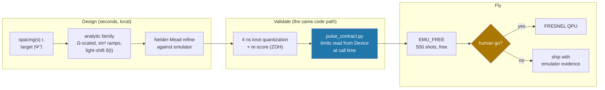
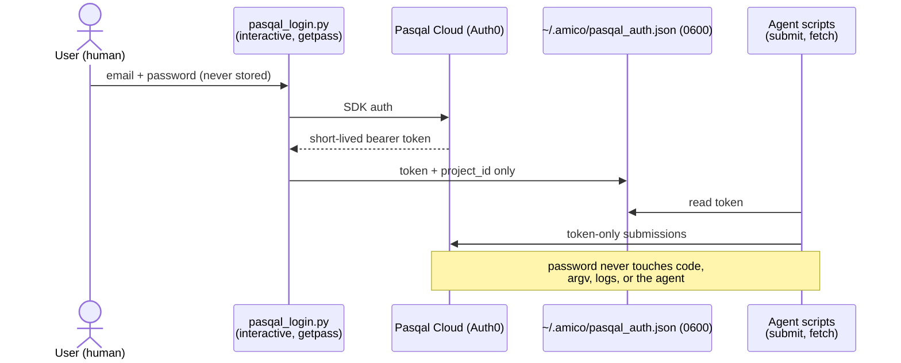

# The Product — geometry-robust entanglement as a service

## The commercial observation

Challenge 01 asks you to **re-optimize the pulse for each spacing**. On a
real machine that's a calibration loop: every register geometry change →
re-tune → re-validate → re-deploy. Neutral-atom QPUs also have *unavoidable*
geometry error: per-shot thermal position jitter and site-placement
tolerance of the tweezers.

Flip the requirement: **one waveform that doesn't care about spacing** is
worth more than N waveforms that each need to know it exactly.

## What we shipped

A single (Ω(t), δ(t)) maximizing the *worst-case* fidelity over the spacing
band, found by optimizing min(F(r₁), F(r₂)):

| | r = 5.0 µm | r = 6.5 µm |
|---|---|---|
| Reference pulse | 0.9926 | 0.7500 |
| **One robust waveform** | **0.99944** | **0.99701** |

That is a **30% spacing tolerance band** (5.0 → 6.5 µm) held above F = 0.997
from a single calibration — and it beats the challenge baseline at both
endpoints by construction, so it also *is* a valid Challenge-01 submission
on its own.

## The pipeline is the product

Packaged as an **Amicode skill** (`rydberg-bell-pulse`, committed to the
personal vault): spacing in → contract-validated `pulse.toml` out → one
command to Pasqal Cloud. The skill encodes the recipe, the traps (signed Ω,
off-grid durations, hardcoded C₆, basis ordering), and the worked artifacts,
so the next problem — or the next teammate — starts from here, not from zero.

## Auth model (worth copying)

## Why this scales past Challenge 01

The same structure — *analytic physics floor → local refinement against the
judge's simulator → contract validation → free-tier cloud → budget-gated
hardware* — is exactly the loop Challenges 02 and 03 need at 5 and 80 atoms.
Nothing in the pipeline is 2-atom-specific except the 40-line pulse family.
