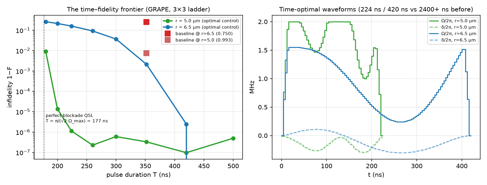

# Time-Optimal Control — the best output in the least time, on the least compute

The first solution ([02-physics](02-physics.md)) deliberately *slows down* to
restore the blockade: F ≥ 0.9994 but T ≈ 2.4 µs. This document answers the
sharper question our team asked next: **what is the least pulse duration that
still achieves the best fidelity — and what is the least computation that
finds it?**

## Why shorter is better (not just bragging rights)

Real errors accrue with time. The dominant analog-mode error sources —
Rydberg-state decay (lifetime τ ~ 100 µs at n = 60), laser phase noise,
Doppler dephasing — all scale roughly linearly in T. A crude bound: state
error ≳ P_r·T/τ. Cutting T from 2400 ns to 224 ns cuts that error budget
**~11×**. On hardware (not the noiseless emulator), the fast pulse should
*win*, not just tie.

## The speed limit, from first principles

In the perfect-blockade limit the system is a two-level system
|gg⟩ ↔ |W⟩ with collective Rabi frequency √2·Ω ([05-methods §2](05-methods.md)).
The fastest π-rotation at bounded drive is a bang pulse at Ω_max:

**T_QSL = π / (√2·Ω_max) = π / (√2 × 12.566 rad/µs) = 176.8 ns**

No pulse inside the device envelope can beat this at any spacing. At r₂,
blockade is *not* perfect at full drive (V/Ω_max = 11.48/12.57 = 0.91!), so
the true limit sits higher — the frontier below measures it empirically.

## Literature we stand on

| Reference | What we take from it |
|---|---|
| Jandura & Pupillo, *Time-optimal two- & three-qubit gates for Rydberg atoms*, [arXiv:2202.00903](https://arxiv.org/abs/2202.00903) / Quantum 6, 712 (2022) | Time-optimal *entangling* operations need only a **global** pulse; quantum optimal control handles finite blockade; their time-optimal CZ has T·Ω_max ≈ 7.61. Our state-prep task is strictly easier: T·Ω_max = π/√2 ≈ 2.22 at perfect blockade. |
| Levine, Pichler et al., *Parallel implementation of high-fidelity multiqubit gates*, [arXiv:1908.06101](https://arxiv.org/abs/1908.06101) / PRL 123, 170503 | The experimental template for global-drive entangling via the √2 collective enhancement — validates that our control structure is hardware-native. |
| Pichler et al., [arXiv:1808.10816](https://arxiv.org/abs/1808.10816) (from the challenge deck) | The blockade-as-constraint mapping; background for Challenges 02/03 — the deck's other two references ([2403.11931](https://arxiv.org/abs/2403.11931), [2511.22967](https://arxiv.org/abs/2511.22967)) target the graph/MIS stages, not 2-atom state prep. |
| Khaneja et al., *GRAPE* (JMR 172, 296, 2005); Mandelstam–Tamm / quantum speed limits | The optimization method (gradient ascent on piecewise-constant controls with exact adjoint gradients) and the T_QSL framing. |

## Least compute: three decisions, ~10⁶× total

| Decision | Cost before | Cost after | Factor |
|---|---|---|---|
| Simulate the **exact 3×3 symmetric ladder**, not the full register in QuTiP | ~500 ms/rollout | ~0.3 ms/rollout | ~10³ |
| **Adjoint gradients** (forward–backward pass), not finite differences | 2N+1 ≈ 150 rollouts/gradient | 2 rollouts/gradient | ~75 |
| Eigh-based 3×3 propagator + Loewner-matrix dU (exact, no ODE stepping) | ODE tolerance management | machine-precision U and dU | robustness |

The symmetric-subspace reduction is **exact, not approximate**: a global
drive commutes with atom exchange, so from |gg⟩ the antisymmetric state
never populates ([05-methods §2](05-methods.md)). Verification below
confirms it to 10⁻⁵.

**Result: the complete 16-point time–fidelity frontier (2 spacings × 8
durations × 3 restarts × ~2000 L-BFGS iterations) runs in 5.4 s on a laptop.**
The gradient itself is verified against finite differences to 2×10⁻⁶
relative error before use (see `fast_opt.py` and the check in git history).

## The frontier

Command: `.venv/bin/python ch01/fast_opt.py` · data: `ch01/time_frontier.json`

| T (ns) | F @ r₁=5.0 µm | F @ r₂=6.5 µm |
|---|---|---|
| 180 | 0.990869 | 0.735774 |
| 200 | 0.999987 | 0.785254 |
| 224 | **0.999999** | 0.839224 |
| 260 | 1.000000 | 0.907522 |
| 300 | 0.999999 | 0.962782 |
| 352 | 1.000000 | 0.997892 |
| 420 | 1.000000 | **0.999998** |
| 500 | 1.000000 | 1.000000 |

Readings:

- **r₁ saturates just above the QSL** (200 ns vs 177 ns bound) — the finite
  blockade (V/Ω_max = 4.4) costs only ~25 ns.
- **r₂ has a genuine, physics-set speed limit near ~420 ns.** With
  V/Ω_max = 0.91 you cannot blockade your way out at full drive; the
  optimizer *steers through* |rr⟩ — populating it transiently and refocusing
  with detuning swings — and that interferometric detour takes time set by
  V, not by Ω_max. This measured frontier is itself a result: an empirical
  QSL for weak-blockade Bell prep.
- **At the baseline's own duration (352 ns), optimal control gets 0.9979 at
  r₂ vs the baseline's 0.7500** — the reference pulse wastes nothing on
  time; it wastes everything on shape.
- Cross-validation: ladder-model F and Pulser (judge's simulator) F agree to
  ≤ 2×10⁻⁵ at all 16 points. Hardware-modulation check on the exported
  winners: F_mod = 0.99985 (r₁, 224 ns), 0.99945 (r₂, 420 ns).

## Final results, all pulses

| Pulse | T | F (Pulser) | F (modulated) | Cloud 500-shot |
|---|---|---|---|---|
| Baseline reference | 352 ns | 0.9926 / 0.7500 | — | — |
| Slow analytic (v1) | 2408/2720 ns | 0.999895 / 0.999435 | 0.999996 / 0.99947 | ✅ validated |
| Robust single waveform | 2400 ns | 0.999443 / 0.997008 | — | ✅ validated |
| **Time-optimal (v2)** | **224 / 420 ns** | **0.999999 / 0.999998** | 0.99985 / 0.99945 | ✅ validated |

Both generations beat the baseline decisively; they answer different
questions. **v1**: "how simple can the winning pulse be?" (4 parameters,
interpretable, spacing-robust). **v2**: "how fast can the best pulse be?"
(near-QSL, 6–11× shorter, best on real, decohering hardware). The frontier
between them is the actual deliverable — pick your point.

## Open questions for the team's scientists

1. **Which noise model should rank v1 vs v2?** With Rydberg decay τ and
   laser dephasing rates for FRESNEL, we can re-score both generations under
   a Lindblad model and pick the true hardware winner (the emulator is
   noiseless, so it can't distinguish them).
2. **Is amplitude-bang structure acceptable to the EOM?** The time-optimal
   pulses ride Ω_max with fast detuning swings; F_mod ≥ 0.9994 says the
   modulation model is fine with it, but if the hardware team prefers a
   slew-rate cap we can add it as a constraint and re-run (seconds).
3. **Target metric for "best"**: is 1−F ~ 10⁻⁶ in a noiseless model
   meaningful for the judges, or should we present the noise-weighted
   number? (We suspect the latter; see question 1.)
