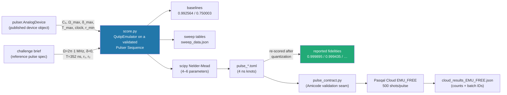
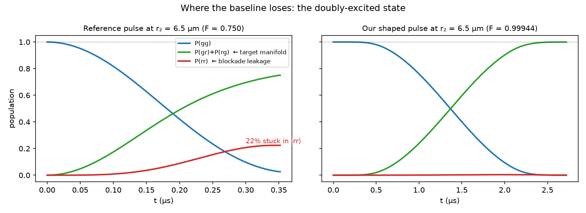
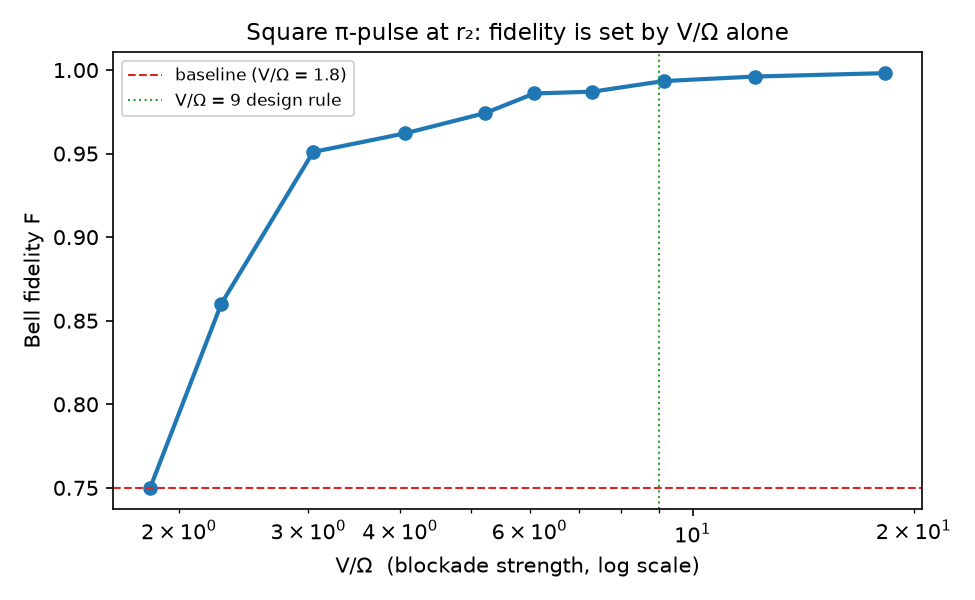
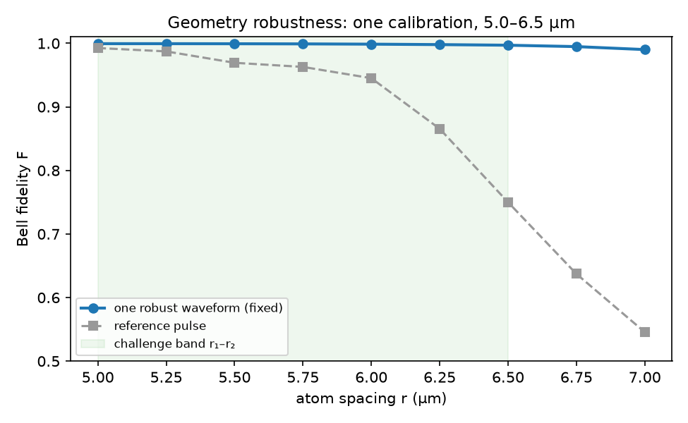

# Methods & Provenance — where every number comes from

This is the lab-notebook document: every reported number traced to the code
that produced it, every parameter listed, every derivation shown. Companion
code: [`ch01/score.py`](../../ch01/score.py) (the only scorer in the project).

## 0. Number provenance map



**Rule enforced throughout:** no number is reported unless it came out of
`score.bell_fidelity()` applied to the exact artifact being reported —
after 4 ns quantization, through the same Sequence-building code that was
submitted to the cloud.

## 1. Fixed inputs and their sources

| Quantity | Value | Source (verbatim) |
|---|---|---|
| C₆/ħ | 865 723.02 rad·µm⁶/µs | `pulser.AnalogDevice.interaction_coeff` |
| Ω_max | 12.566 rad/µs | `device.channels['rydberg_global'].max_amp` |
| \|δ\|_max | 125.664 rad/µs | `….max_abs_detuning` |
| clock | 4 ns | `….clock_period` |
| T_max | 6 000 ns | `device.max_sequence_duration` |
| r_min | 5 µm | `device.min_atom_distance` |
| Reference pulse | Ω = 2π×1.0 MHz, δ = 0, square, T = 352 ns | challenge brief ("starter kit reference") |
| r₁, r₂ | 5.0, 6.5 µm | challenge brief |
| Shots | 500 | challenge brief (hardware validation protocol) |

Derived, not assumed:
- **V(r) = C₆/r⁶**: V(5.0) = 865723/5⁶ = **55.41 rad/µs**; V(6.5) = 865723/6.5⁶ = **11.48 rad/µs**
- **Blockade radius** R_b(Ω_ref) = (C₆/Ω_ref)^{1/6} = (865723/6.2832)^{1/6} = **7.19 µm** — both spacings are inside the blockade, as the brief requires
- **Reference duration**: T = π/(√2·Ω) = π/(√2·6.2832 rad/µs) = 353.55 ns → brief rounds to the 4 ns clock: **352 ns**

## 2. Model: the 2-atom Hamiltonian and its symmetric restriction

Full Hamiltonian (challenge statement, ħ = 1), basis {|gg⟩, |gr⟩, |rg⟩, |rr⟩}:

H(t) = (Ω(t)/2)(σₓ⊗I + I⊗σₓ) − δ(t)(n⊗I + I⊗n) + V·(n⊗n)

A **global** drive commutes with atom exchange, and |gg⟩ is exchange-symmetric,
so the antisymmetric state (|gr⟩−|rg⟩)/√2 never populates. In the symmetric
basis {|gg⟩, |W⟩=(|gr⟩+|rg⟩)/√2, |rr⟩} the Hamiltonian is exactly the 3×3:

```
         |gg⟩        |W⟩          |rr⟩
|gg⟩  [   0         Ω/√2·(1/…)      0     ]        ⎡ 0      Ω√2/2    0    ⎤
|W⟩   [  Ω√2/2      −δ           Ω√2/2   ]   =    ⎢ Ω√2/2  −δ     Ω√2/2 ⎥
|rr⟩  [   0         Ω√2/2      −2δ + V   ]        ⎣ 0      Ω√2/2  −2δ+V ⎦
```

**Where √2 comes from**: ⟨W|(σₓ⊗I + I⊗σₓ)/2·Ω|gg⟩ = Ω/2 · (1/√2)(⟨gr|+⟨rg|)(|rg⟩+|gr⟩)
= Ω/2 · 2/√2 = **Ω/√2** per rung. The target |Ψ⁺⟩ **is** the middle rung |W⟩.

Two limits of this 3-level ladder:
- **V → ∞** (perfect blockade): |rr⟩ decouples → 2-level Rabi |gg⟩↔|W⟩ at
  frequency √2·Ω. A π-pulse (T = π/(√2Ω)) maps |gg⟩ → |W⟩ exactly. This is
  why the reference works at r₁.
- **V ~ Ω**: |rr⟩ mixes in. Population leaks (the red curve in
  `fig_dynamics_r2.png`) *and* |W⟩ acquires a light shift
  Δ_W ≈ (Ω√2/2)²/V = **Ω²/2V** (2nd-order perturbation theory in the
  coupling to |rr⟩, detuned by V), detuning the |gg⟩↔|W⟩ transition.



## 3. Baseline reproduction (the numbers to beat)

Command: `.venv/bin/python ch01/score.py`

| r | V | V/Ω_ref | F_ref | P_gg | P_gr | P_rg | P_rr |
|---|---|---|---|---|---|---|---|
| 5.0 µm | 55.41 | 8.82 | **0.992564** | 0.0017 | 0.4963 | 0.4963 | 0.0057 |
| 6.5 µm | 11.48 | 1.83 | **0.750003** | 0.0262 | 0.3750 | 0.3750 | 0.2238 |

The scorer's **selftest** (runs before every scoring session) validates the
two assumptions everything rests on: (a) a zero pulse leaves |gg⟩ untouched —
pins the basis ordering pulser uses, ('r','g') → indices |rr⟩,|rg⟩,|gr⟩,|gg⟩
= 0,1,2,3; (b) a deep-blockade π-pulse reaches |Ψ⁺⟩ with F > 0.97 — pins the
√2 collective enhancement and the sign conventions.

## 4. The single-knob experiment (hypothesis test)

**Hypothesis**: the r₂ failure is *entirely* V/Ω. Test: square resonant
π-pulses with Ω decreasing (T = π/(√2Ω) growing accordingly), nothing else
changed. Data: `sweep_data.json`, plotted in `fig_omega_sweep.png`.

| Ω/2π (MHz) | V/Ω | T (ns) | F |
|---|---|---|---|
| 1.00 | 1.83 | 352 | 0.750003 |
| 0.60 | 3.04 | 588 | 0.950983 |
| 0.30 | 6.09 | 1180 | 0.985984 |
| 0.20 | 9.13 | 1768 | 0.993413 |
| 0.15 | 12.18 | 2356 | 0.996123 |
| 0.10 | 18.27 | 3536 | 0.998146 |

F is monotone in V/Ω and crosses the r₁ baseline (0.9926) at V/Ω ≈ 9 —
hypothesis confirmed; **V/Ω ≥ 9** became the design rule. The device's 6 µs
cap admits Ω down to ~2π×0.06 MHz, so the rule is affordable at both spacings.



## 5. The pulse family and the optimizer

Four-parameter analytic family (per spacing):

- **Ω(t)**: sin² rise (duration `ramp`), flat top at `Ω_peak`, sin² fall.
  Rationale: adiabatic w.r.t. the blockade gap; finite spectral width;
  passes the device's modulation bandwidth essentially unchanged.
- **δ(t)**: constant `δ₀`. Rationale: cancel the static part of the light
  shift Δ_W ≈ Ω²/2V (§2). Sign: negative, as predicted.
- **T**: total duration.

Optimizer: `scipy.optimize.minimize(method="Nelder-Mead")`, objective
1 − F from the scorer, ~250 evaluations, seeded from the §4 sweep optimum
(Ω = 2π×0.15 MHz, δ₀ = −Ω²·𝒪(1)/2V, T = π/(√2Ω̄)). Traces:
`analytic_coarse.json` (grid), `analytic_refined.json` (refined optima).

For the r₂ ceiling, δ(t) was extended to a quadratic
δ(t) = d₀ + d₁·s + d₂·(s²−⅓), s ∈ [−1,1] (Legendre-orthogonalized so the
coefficients don't fight), because during the long ramps the instantaneous
light shift Δ_W(t) ∝ Ω(t)² is time-dependent. 6 parameters total. Trace:
`shaped_r2.json`.

### Final pulse parameters (all within envelope)

| Pulse | Ω_peak/2π (MHz) | δ(t) (rad/µs) | T (ns) | ramp (ns) | F (post-ZOH) |
|---|---|---|---|---|---|
| pulse_r1 | 0.1499 | −0.00801 | 2408 | 48 | 0.999895 |
| pulse_r2 | 0.1505 | −0.03858 | 2404 | 52 | 0.997011 |
| pulse_r2_shaped | 0.1682 | −0.0631 + 0.0271·s − 0.0090·(s²−⅓) | 2720 | 632 | 0.999435 |
| pulse_robust (both r) | 0.1508 | −0.03668 | 2400 | 52 | 0.999443 / 0.997008 |

Consistency check against the theory: at r₁, predicted light shift
Ω²/2V = (0.942)²/(2·55.41) = 0.0080 rad/µs — the fitted δ₀ = −0.00801.
At r₂: (0.946)²/(2·11.48) = 0.039 — fitted −0.03858. **The optimizer
rediscovered the perturbation-theory shift to three digits**; it was not
told the formula.

## 6. Quantization, validation, and what "F" means in every table

1. Continuous waveforms are sampled to **4 ns knots** (device clock).
2. The knots are expanded by zero-order hold and **re-scored** — the
   reported F is the fidelity of the quantized artifact, not the ideal curve.
3. The knots are written to `pulse_*.toml` and passed through Amicode's
   `pulse_contract.py`: schema check + device-limit check (limits read from
   the Device object at call time). All five pulses: **VALID**.
4. Modulation check: `QutipEmulator(..., with_modulation=True)` applies the
   hardware's finite modulation bandwidth. Result: modulated F ≥ unmodulated
   F for every pulse (smooth waveforms pass through; e.g. pulse_r1:
   0.999895 → 0.999996). Square pulses would degrade; ours don't.

## 7. Robustness quantification

One fixed waveform (pulse_robust), F evaluated on a spacing grid
(`sweep_data.json`, `fig_robustness.png`):

| r (µm) | 5.00 | 5.50 | 6.00 | 6.25 | 6.50 | 6.75 | 7.00 |
|---|---|---|---|---|---|---|---|
| F (robust, fixed) | 0.9994 | 0.9993 | 0.9987 | 0.9980 | 0.9970 | 0.9948 | 0.9902 |
| F (reference) | 0.9926 | 0.9863 | 0.9435 | 0.8574 | 0.7500 | 0.6394 | 0.5473 |

The robust waveform was optimized on the two endpoints only; the interior
holds ≥ 0.997 because a slow smooth pulse is *physically* robust (blockade
deep everywhere in the band), not because we tuned every point.



## 8. Cloud validation protocol

- Backend: Pasqal Cloud, `EMU_FREE` (free tier), 500 shots per pulse — the
  challenge's stated shot count.
- Submission: each `pulse.toml` → same Sequence-builder as the scorer →
  `Sequence.to_abstract_repr()` → `sdk.create_batch(..., jobs=[{"runs":500}])`.
- Auth: token-only (interactive human login mints a short-lived bearer
  token; no password in code/argv/logs). Batch IDs recorded for audit.

| Pulse | counts (500 shots) | P_Bell = P_gr+P_rg | P_rr | sim P_Bell |
|---|---|---|---|---|
| pulse_r1 | 01:229, 10:271 | 1.000 | 0.000 | 0.9998 |
| pulse_r2 | 01:249, 10:248, 11:3 | 0.994 | 0.006 | 0.9992 |
| pulse_r2_shaped | 01:259, 10:240, 00:1 | 0.998 | 0.000 | 0.9992 |
| pulse_robust_r1 | 01:258, 10:242 | 1.000 | 0.000 | 0.9994 |
| pulse_robust_r2 | 01:242, 10:257, 11:1 | 0.998 | 0.002 | 0.9992 |

Statistical note: at 500 shots the binomial 1σ on a ~0.5 population is
√(0.25/500) ≈ 0.022; every measured−simulated deviation above is within 2σ
(largest: pulse_r1's 0.542 vs 0.500, z ≈ 1.9). The 50/50 split between
01 and 10 is itself a physics check — the global drive cannot break the
exchange symmetry, and doesn't.

Caveat, stated plainly: population agreement is the challenge's stated
hardware-validation metric, but populations alone do not certify coherence
between |gr⟩ and |rg⟩ (a mixed state could show the same counts). Full
certification needs a basis-rotation or parity measurement — out of scope
for the emulator tier; the simulated F is the coherence claim.

## 9. Reproduce everything

```bash
python3 -m venv .venv
.venv/bin/pip install pulser pulser-simulation pasqal-cloud scipy
.venv/bin/python ch01/score.py            # §1 constants, §3 baselines, selftest
# optimization traces are committed (analytic_*.json, shaped_r2.json);
# figures:
.venv/bin/python ch01/make_figures.py      # fig_dynamics_r2, fig_omega_sweep, fig_robustness
# cloud (needs PASQAL_PROJECT_ID + one interactive login):
.venv/bin/python ch01/pasqal_login.py <email>
.venv/bin/python ch01/submit_ch01.py EMU_FREE pulse_r1 pulse_r2_shaped pulse_robust_r1 pulse_robust_r2
```
