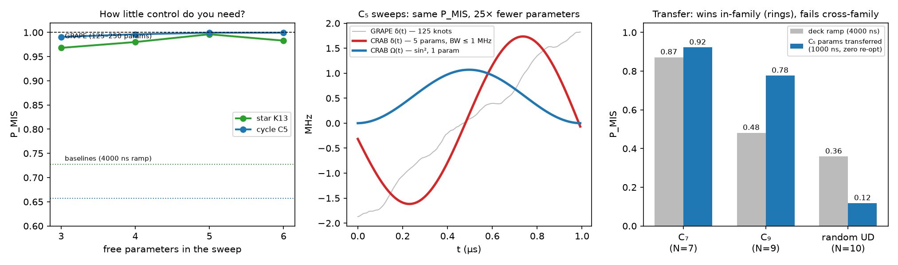

# Low-bandwidth sweeps & the transfer experiment

*This document follows the experiment protocol from
[docs/ch01/08-prompts.md](../ch01/08-prompts.md) — hypothesis before run,
predictions before data, stats before claims, scope limits in the verdict.
Code: [`ch02/crab02.py`](../../ch02/crab02.py); raw output:
[`ch02/crab02_results.json`](../../ch02/crab02_results.json).*

## Why the scientists asked for this

The GRAPE sweeps of [02-methods](02-methods.md) score 0.9999+ but use
125–250 free knots — broadband control that is hard to interpret, hard to
calibrate, and wasteful: bandwidth and optimizer compute are both
resources. The right scientific question is **how little control is
enough** — and whether a sweep, once found, is *reusable* on bigger
problems without paying the optimization cost again. That reusability is
what matters "when the problem is massive": re-optimizing per instance
costs a 2ᴺ simulation per iteration, while *transferring* parameters
costs one evaluation, total.

## Hypotheses (pre-registered)

- **H1 (bandwidth):** a CRAB-parameterized sweep — Ω = A·sin²(πt/T),
  δ = linear ramp + K sine modes, hence ≤ 3+K parameters and spectral
  content ≤ K/(2T) *by construction* — reaches P_MIS within 10⁻² of GRAPE
  on both deck graphs with K ≤ 3.
- **H2 (transfer):** the C₅-optimized parameters, applied unchanged,
  beat the deck baseline on larger rings (C₇, C₉) *and* on a random
  unit-disk instance (N = 10).

Predictions: H1 likely (CRAB literature: Caneva, Calarco & Montangero,
PRA 84, 022326 (2011)); H2 confident for rings (same local structure —
concentration of optimal parameters over instance families is documented
for QAOA: Brandão et al., arXiv:1812.04170), *uncertain* for the random
instance (different degree structure) — flagged as the risky prediction.

## Design

| | |
|---|---|
| Independent variable | K (number of detuning modes); test graph (transfer arm) |
| Dependent variable | P_MIS from the exact propagator, cross-scored in Pulser |
| Controls | T = 1000 ns fixed; device bounds enforced; same Nelder-Mead budget (4 restarts × 600 evals) per K |
| Baselines | deck ramp (4000 ns) on every graph; GRAPE ceiling on deck graphs |
| Compute budget | ≤ 1 min per (graph, K); transfer evaluations seconds each (sparse Krylov, no optimization) |

## Run (verbatim numbers from `crab02_results.json`)

**Mode sweep** — P_MIS (Pulser-scored) vs parameter count:

| params (K) | star K₁,₃ | cycle C₅ | bandwidth cert. | compute |
|---|---|---|---|---|
| 3 (K=0) | 0.968099 | 0.990699 | ≤ 0.5 MHz | 13–15 s |
| 4 (K=1) | 0.980111 | 0.996159 | ≤ 0.5 MHz | 18–42 s |
| **5 (K=2)** | **0.996188** | **0.999387** | **≤ 1.0 MHz** | 21–44 s |
| 6 (K=3) | 0.982980 | 0.999329 | ≤ 1.5 MHz | 20–46 s |
| GRAPE reference | 0.999998 | 0.999993 | broadband | ~2 min, 125–250 params |
| deck baseline | 0.727135 | 0.657049 | — | — |

The star's K=3 dip below K=2 is optimizer variance at a fixed evaluation
cap (Nelder-Mead in 6-D hit maxfev in all restarts), not physics — K=3
contains K=2 as a subspace, so its true optimum cannot be worse.

**Cloud validation** (EMU_FREE, 500 shots, the 5-parameter winners):
star **498/500** measured (0.9960, sim 0.99619 — deviation 0.4σ);
C₅ **500/500**. Batch IDs in `cloud_results_EMU_FREE.json`.

**Transfer** — C₅'s 5 parameters, unchanged, 1000 ns, vs the 4000 ns deck
ramp on each graph (evaluation cost: < 1 s per graph, zero optimization):

| graph | N | α | transferred | baseline | verdict |
|---|---|---|---|---|---|
| cycle C₇ | 7 | 3 | **0.9226** | 0.8718 | ✓ wins, 4× faster |
| cycle C₉ | 9 | 4 | **0.7770** | 0.4813 | ✓ wins by +0.30 |
| random UD | 10 | 8 | 0.1181 | **0.3592** | ✗ fails |

## Stats

Shot-noise floor at 500 shots: ±0.022 on any probability near 0.5, ±0.003
near 0.99 — all cloud-vs-sim deviations within 1σ. Mode-sweep differences
between K=2 and GRAPE (3–4×10⁻³) exceed optimizer-restart scatter
(~10⁻³) — the remaining gap to GRAPE is real, and is the price of the
bandwidth certificate. Transfer margins (+0.05, +0.30, −0.24) are far
above all numerical tolerances (state-vector simulation is exact to
integrator precision; no shots involved).

## Verdict

- **H1 CONFIRMED (with a nuance):** 5 parameters and a ≤ 1 MHz bandwidth
  certificate reach within 4×10⁻³ of broadband GRAPE — and still beat the
  deck baseline by +0.27/+0.34. Three parameters already beat it.
- **H2 PARTIAL — and the split is the finding:** parameters transfer
  *within a structural family* (rings: same degree, same local blockade
  environment; the C₉ win is +0.30 with zero re-optimization) but *not
  across families* (the random instance has α = 8 of 10 — a nearly
  unconstrained graph wanting almost-full excitation, opposite in
  character to a ring). Consistent with QAOA parameter-concentration
  being family-specific.
- **Scope limits:** N ≤ 10, exact simulation, three transfer instances,
  one random seed. All test sizes are classically trivial — these are
  *verification* instances for the protocol's transfer property, not
  evidence of quantum advantage (see the scope-discipline clause in the
  prompt pack). The measured claim that scales: transfer evaluation cost
  is O(1) in optimization effort, and within-family quality survives at
  least to ~2× the training size.

## What this buys for Challenge 03

The Ch03 instances are random unit-disk graphs at 10–85+ atoms — a
*family*. The recipe this experiment justifies: optimize the 5-parameter
sweep once on a simulable member (N ≈ 10–16, sparse Krylov), transfer
across the family, spend hardware shots only on validation. Bandwidth
≤ 1 MHz also sits comfortably inside FRESNEL's 5–8 MHz modulation
bandwidth — these sweeps are hardware-native by construction.

