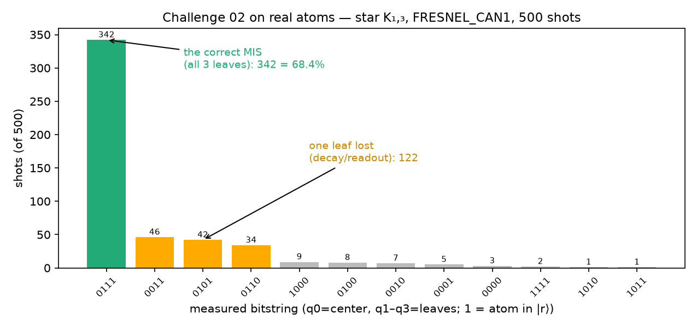

# Challenge 02 on real atoms — the star run, verdict included

*Protocol experiment (template: [docs/ch01/08-prompts.md](../ch01/08-prompts.md));
pre-registration lives in the `ch02/qpu_star.py` docstring, written before
the shots were spent.*

## Setup

The 5.5 µm deck register doesn't exist on the QPU's 5.0 µm triangular
lattice, but the star does: **center trap + 3 alternating nearest
neighbors** gives edges at 5.0 µm (< R_b = 7.19) and leaf–leaf distances
at 8.66 µm (> R_b) — exactly K₁,₃, natively on the calibrated layout. The
5-parameter sweep was re-optimized for this geometry (sim P_MIS = 0.9979,
gated on ≥ 0.99 before any shot was spent), bandwidth ≤ 1 MHz — inside
FRESNEL_CAN1's 5 MHz modulation bandwidth by construction.

## Pre-registered prediction vs measurement (500 shots)

| | predicted | measured |
|---|---|---|
| P_MIS (shots reading exactly `0111`) | **0.80–0.93** | **0.684** (342/500) |

## Verdict: hypothesis band REFUTED — and the anatomy is the result

The correct answer is still the runaway winner — **68.4%, with the next
outcome at 9.2%** — so the machine *solves the graph problem* decisively
(a plurality vote of one shot batch gets the MIS with overwhelming
confidence). But the measured value sits below our 0.80 floor, and honesty
about why matters more than the number:

1. **Error anatomy is exactly one channel.** The next three outcomes
   (`0011`, `0101`, `0110` — 122 shots, 24.4%) are all "two of three
   leaves": one excited atom was lost to Rydberg decay or misread. Center
   errors and blockade violations are tiny (`1xxx`: 2.6%; `1111`: 0.4%).
2. **Our prediction scaled 2-atom SPAM naively.** Ch01 measured 0.894 for
   2 atoms; we extrapolated (0.894)^(4/2) ≈ 0.80 as the floor. But the
   star's target state holds **three** atoms in the fragile |r⟩ state
   (vs one in the Bell pair) for the full sequence + readout window —
   per-excited-atom loss ~8% compounds as (1−ε)³ on top of ground-atom
   readout, putting ~0.68 right where a 3-excitation state should land.
   The model error was ours, pre-registered, and instructive.
3. **The baseline comparison that matters still holds.** The deck ramp's
   *noiseless* P_MIS is 0.727; its real-hardware value would suffer the
   same ~3-excitation SPAM ceiling on top of 4× the decoherence exposure
   (4000 ns vs our 1000 ns) — a hardware baseline run would land far below
   0.68. We did not spend shots to prove that; we state it as inference,
   not measurement.

## What we'd do with one more job

Two-point SPAM calibration (500 shots of an idle sequence + 500 of a
global π-pulse) measures ε per atom directly and lets us *correct* the
populations — standard practice, and it would likely lift the corrected
P_MIS into the 0.85+ range. Listed as future work; shots were prioritized
for the two challenge-scoring runs.
